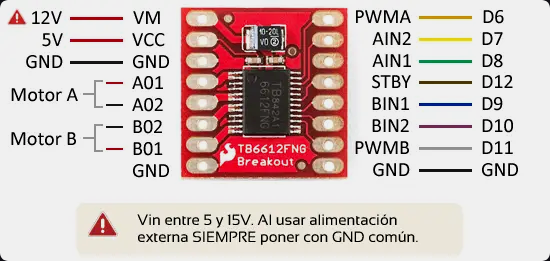
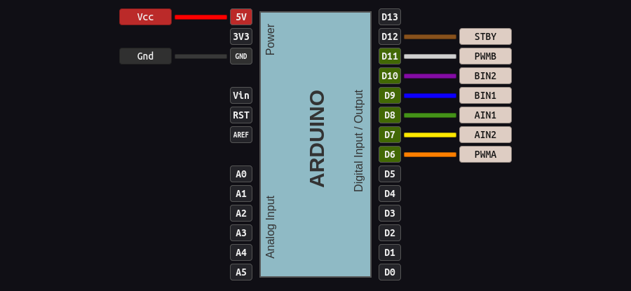

# Robots (Velocista y Sumo)

##  Esquema de montaje

### *fuente esquemas: https://www.luisllamas.es/arduino-motor-dc-tb6612fng/*
### *fuente codigo base sumo: https://www.youtube.com/watch?v=NjcQ3KwS5uU&t=53s*
